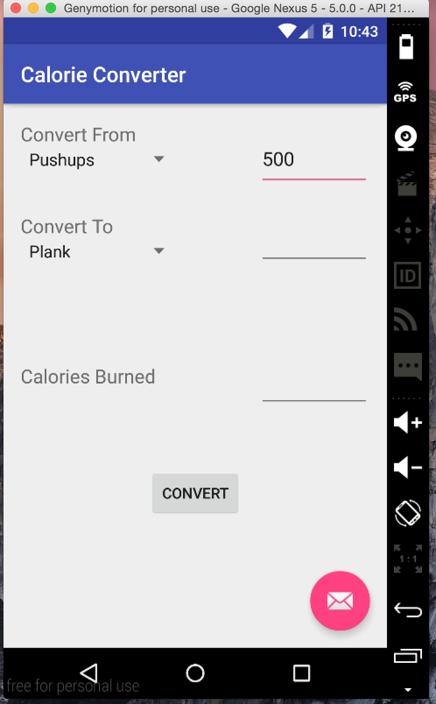
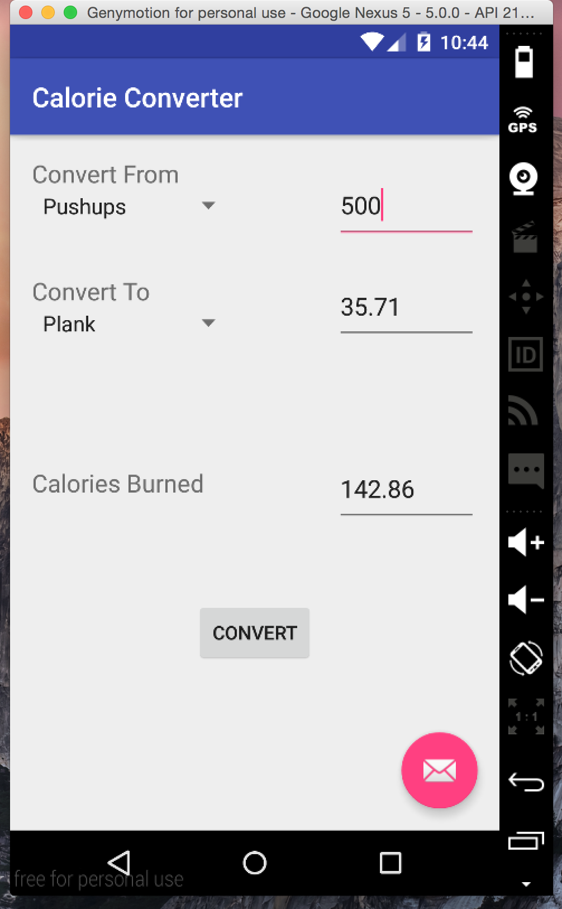
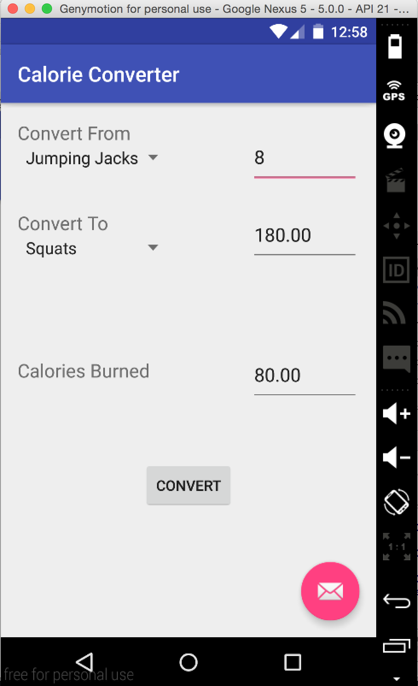

# PROG 01: Crunch Time

My app is called Calorie Converter. The user selects an excercise and enters how many reps or minutes of that exercise he has done. The user then selects another exercise he would want to convert to. When the user presses the convert button, the number of calories burned for a 150lb person is calculated and the number of minutes or reps of the other exercise is calculated.

## Authors

David Koh ([dkoh@berkeley.edu](mailto:dkoh@berkeley.edu))

## Demo Video

See [Calorie Converter] (https://www.youtube.com/watch?v=N3yOQNkfHOY&feature=youtu.be)

## Screenshots

## Acknowledgments

* Hat tip to anyone who's code was used
* Any other support

*Feel free to enhance your README. For Markdown syntax, see [the GitHub Guides](https://guides.github.com/features/mastering-markdown/). Remove this line in your submission.*
